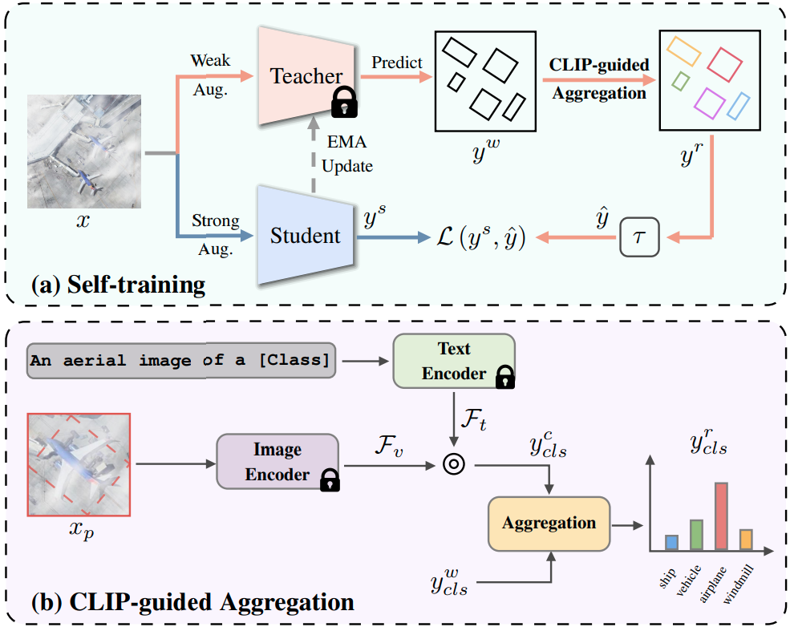

# CLIP-Guided Source-Free Object Detection in Aerial Images

## 💥 News

This paper is accepted by IGARSS2024 as a oral representation and is accessible [here](https://arxiv.org/abs/2401.05168).

## 🎨 Overview

<div align="center">
  
</div>

Overview of the proposed SFOD framework. 

## 🎮 Getting Started

### 1. Install Environment
```bash
conda create --name sfod python=3.8
conda activate sfod

pip install torch===1.7.1+cu110 torchvision===0.8.2+cu110 torchaudio===0.7.2 -f https://download.pytorch.org/whl/torch_stable.html --no-cache

git clone https://github.com/Lans1ng/SFOD-RS.git
cd SFOD-RS
pip install -r requirements.txt
```

### 2. Prepare Dataset 

- Download the DIOR dataset ([Google Drive](https://drive.google.com/drive/folders/1UdlgHk49iu6WpcJ5467iT-UqNPpx__CC) or [BaiduNetDisk](https://pan.baidu.com/s/1iLKT0JQoKXEJTGNxt5lSMg#list/path=%2F)).

- Download the corruption images with cloud (DIOR-Cloudy) from [Google Drive](https://drive.google.com/drive/folders/11l2L5ScsFQ7FH64vd0mub9hVcO1BK1py).

Note : For more detail about other corruptions and original cloudy image, please refer to [DOTA-C](https://github.com/hehaodong530/DOTA-C).

- Organize the dataset as follow:

  ```shell
  dataset/
  ├──DIOR/
  │   ├── Annotations 
  │   ├── JPEGImages
  │   ├── ImageSets
  │   ├── Corruption
  │   │   ├── JPEGImages-brigtness
  │   │   ├── JPEGImages-cloudy
  │   │   ├── JPEGImages-contrast
  │   │   ├── ...
  │   │   ├── JPEGImages-zoom_blur  
  ```
  - `JPEGImages` contains all images in DIOR dataset.
  - `ImageSets` contains all train/val/test splits in DIOR dataset.
  - `Corruption` contains all kinds of corrupted images on DIOR dataset.

### 3. Download Checkpoints
Before training，please download the pretrained Oriented-RCNN model weights [baseline.pth](https://drive.google.com/file/d/1JOxD7eHrMkDFe9rBEgSTxBFAuTW1jXza/view?usp=drive_link) trained from DIOR training set to `baseline` fold.

### 4. Training

Take DIOR-Cloudy dataset as examples:
```bash
python train.py configs/unbiased_teacher/sfod/unbiased_teacher_oriented_rcnn_selftraining_cga.py --cfg-options corrupt="cloudy"
```
Note: If you want to retrain the Oriented-RCNN baseline model, please refer to [mmrotate](https://github.com/open-mmlab/mmrotate). 

### 5. Testing
Take DIOR-Cloudy dataset as examples:
```bash
python test.py configs/unbiased_teacher/sfod/unbiased_teacher_oriented_rcnn_selftraining_cga.py work_dirs/unbiased_teacher_oriented_rcnn_selftraining_cga/latest.pth --eval mAP --cfg-options corrupt="cloudy"
```

## 💡 Acknowledgement

- [DOTA-C](https://github.com/hehaodong530/DOTA-C)
- [mmrotate](https://github.com/open-mmlab/mmrotate)
- [SSOD](https://github.com/hikvision-research/SSOD)
- [SOOD](https://github.com/HamPerdredes/SOOD)
- [VFA](https://github.com/csuhan/VFA)
- [SoftTeacher](https://github.com/microsoft/SoftTeacher)

## 🖊️ Citation

If you find this project useful in your research, please consider cite:

```BibTeX
@article{liu2024clip,
  title={CLIP-guided Source-free Object Detection in Aerial Images},
  author={Liu, Nanqing and Xu, Xun and Su, Yongyi and Liu, Chengxin and Gong, Peiliang and Li, Heng-Chao},
  journal={arXiv preprint arXiv:2401.05168},
  year={2024}
}
```